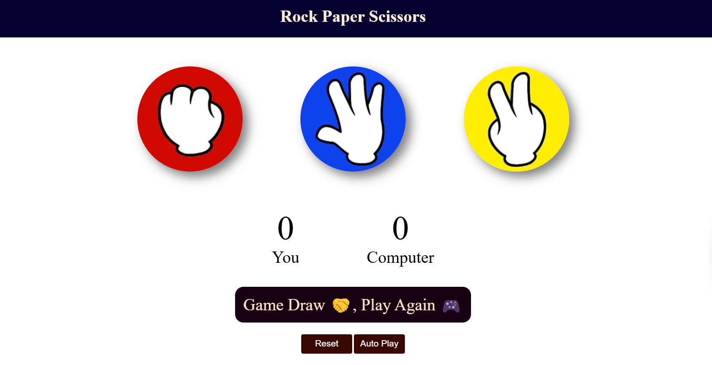

# Rock Paper Scissors Game

This is my first project using HTML, CSS, and JavaScript. It's a simple Rock Paper Scissors game that includes interactive gameplay, styling, and images. The project consists of three main files: `index.html`, `style.css`, and `app.js`, along with an `images` folder containing pictures for rock, paper, and scissors.

## Learned From
Apna College - (JavaScript Tutorial for Beginners to Pro (with Notes, Projects & Practice Questions))

## Table of Contents

- [Introduction](#introduction)
- [Features](#features)
- [Technologies Used](#technologies-used)
- [Setup](#setup)
- [Usage](#usage)
- [Screenshots](#screenshots)
- [License](#license)

## Introduction

This project is a basic implementation of the classic Rock Paper Scissors game. Players can select between rock, paper, and scissors, and the game will determine the winner based on standard rules.

## Features

- Interactive gameplay
- Responsive design
- Visual representation of choices with images
- Simple and clean user interface

## Technologies Used

- HTML
- CSS
- JavaScript

## Setup

1. Clone the repository:
    ```bash
    git clone https://github.com/iamanrajput/rock-paper-scissors.git
    ```

2. Navigate to the project directory:
    ```bash
    cd rock-paper-scissors
    ```

3. Open `index.html` in your browser to play the game.

## Usage

1. Open the `index.html` file in a web browser.
2. Choose rock, paper, or scissors by clicking on the corresponding image.
3. The game will display the computer's choice and the result of the match.

## Screenshots



## License

This project is licensed under the MIT License. See the [LICENSE](LICENSE) file for more details.
# Rock-Paper-Scissors
